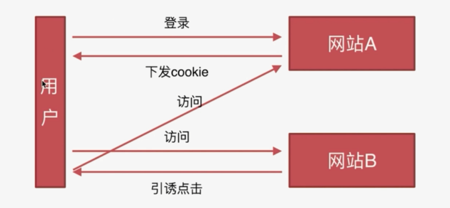

# 安全类

### CSRF

* 概念：跨站请求伪造
* 缩写：Cross-site request forgery
* 攻击原理：点击其他网站的，会拿到我的cookie请求一个曾经某网站的有漏洞的API。
* 条件：1.登录过，有cookie。2.有漏洞的API。

* 防御：
```
服务器下发给浏览器token。服务端加Token验证
Referer 验证：判断是不是我这个站点下的来源，
隐藏令牌：隐藏在HTTP请求head中，和token
```

### XSS

* 概念：跨域脚本攻击
* cross-site scripting
* 原理：向你页面注入JS运行，比如你的提交区提交。
* 防御：就是让你注入的JS不允许执行。