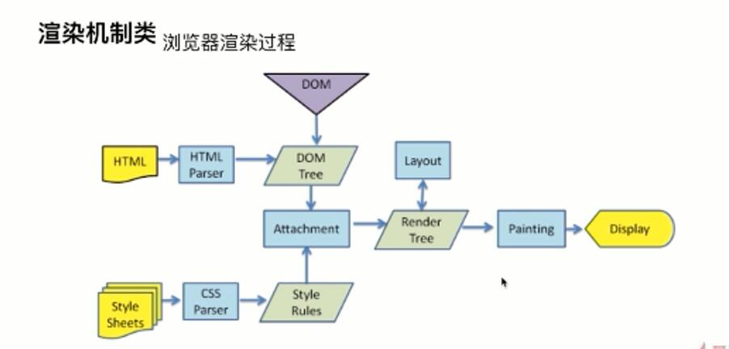
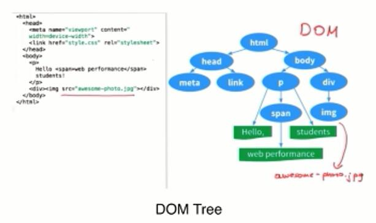
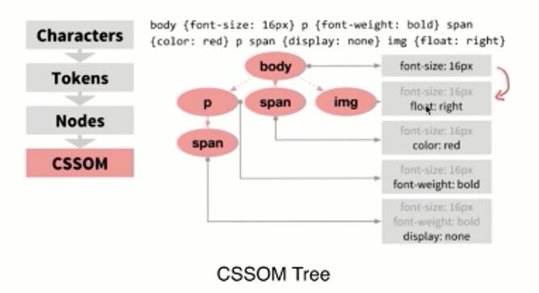
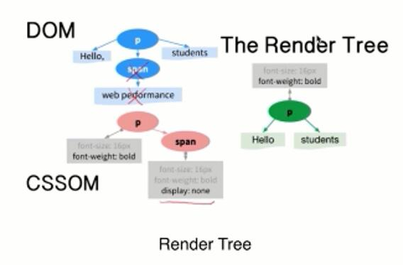

# 渲染机制

### DOCTYPE
* DTD：文档类型定义的语法规则，用来定义XML和HTML的文件类型。让浏览器使用它来判断文件类型，绝对用什么协议解析，及切换浏览器模式。定义文档类型的语法。
* DOCTYPE：告诉浏览器我是什么文档类型和DTD规范，
* 常见；
```
HTML5 : <!DOCTYPE html>
HTML 4.01 Strict/Transitional 严格模式、传统模式
严格不包括展示性和废弃的一些元素（font）
```

### 浏览器是怎么渲染的？

* 总流程就是拿到HTML、css文件开始解析为DOM树，CSSOM树，经过layout计算形成render树，然后浏览器开始绘制painting。


* 拿到HTML文件，解析为DOM树。



* 拿到CSS文件，解析为CSSOM树。


* 经过layout就是把CSSOM树和DOM树计算，计算完就是render tree。



### 重排Reflow

* DOM节点都有自己的盒子，浏览器根据样式计算，将DOM放在该放出现的位置。这个过程称为reflow。

* 触发：
* JS增删改DOM节点
* JS移动DOM位置，做个动画。
* 修改CSS样式
* JS Resize窗口（移动没有这个问题），或滚动的时候。
* 修改网页的默认字体。

### 重绘Repaint

* 就是DOM的属性确定下来，画在屏幕上。
* DOM改动、CSS改动。
* 如何避免最小的repaint?就比如你有很多节点你改动或者填入，要形成一段字符串码，一次性拼接完成，然后推到DOM节点中，不要形成一个退一个。


### 布局Layout


