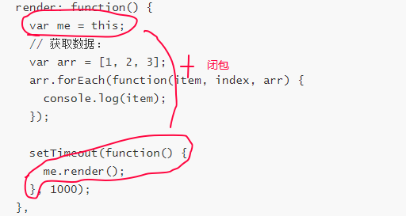
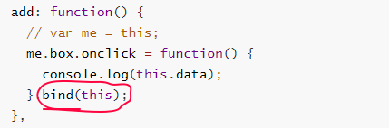

# 页面性能类

## 提升页面性能的方法有哪些？

* 1.资源要压缩合并，减少HTTP请求。
```
CSS：外网地址，就涉及到域名解析的过程；
JS：就涉及到脚本的同步加载还是异步加载，同时影响页面的DOM tree/CSSOM 树的渲染；
```

* 2.非核心代码使用异步加载，异步加载的方式，区别。
```
【方式】
1.动态异步脚本。页面动态添加script标签。
2.defer
3.async

【区别】
1.defer:都是异步加载，在HTML解析完成后执行，有多个JS的话，按顺序进行执行。
2.async:都是异步加载，加载完成后就开始执行，和执行顺序和加载顺序都没有关系。
```

* 【defer】:head标签内有defer异步加载的JS，可以看到body内的HTML解析完成后（包括DOM树怎么渲染，同步的脚本下载完成后的执行后），才执行异步的脚本。
* 但是异步的脚本其实早就开始下载了。
* 使用：就是所有的脚本都可以写defer异步加载的方式。
```
<head>
  <script src="./test_derfer_1.js" type="text/javascript" defer></script>
  <script src="./test_derfer_2.js" type="text/javascript" defer></script>
</head>

<body>
  <div class="app">
    <div class="box" id="box"></div>
  </div>
  <script src="./index.js" type="text/javascript"></script>
</body>
------------------------
1
df_1
df_2
```

* 【async】：head头部放入async异步加载的JS，async_1.js较大，可以看到输出的结果就是异步加载的脚本，只要它下载完成，就要开始执行脚本
* 不管你DOM树有没有渲染好或你同步的JS有没有执行的。
* 使用：单独的JS的内容，不依赖其他文件的JS。可以让它下载后执行。

* 3.浏览器缓存，缓存的分类，和原理
```
【强缓存】：在一定时间内，不直接请求，拿过来就用。
Expires : 服务端端的绝对过期时间，有可能客户端时间和浏览器不一样。
Cache-Control:max-age = 3600 ：相对时间，3600秒内不会向服务器拿这个文件，以这个为主。

【协商缓存】：强缓超出过期时间，浏览器有这个副本，不确定能不能用，需要请求下，返回的状态码是304
1.Last-Modified 上次服务器带的这个时间。
2.下次浏览器请求时，会用这个if Modified-Since字段，
把Last-Modified字段的val时间传给服务器。
3.问能不能我们这个副本能不能用。

if-None-Match:把上次Etag的hash值作为该字段的值，传回去，就知道哪次副本的版本还能不能用。
一些文件也许会周期性的更改，但是他的内容并不改变(仅仅改变的修改时间)，这个时候我们并不希望客户端认为这个文件被修改了，而重新GET;
```

```
不带缓存的请求：
【Request：】
GET /i/yahoo/gif HTTP 1.1
Host: us.yimg.com
【Response:】
HTTP 1.1 200 OK
Last-Modified:Tue,12 Dec 200603:03:59 GMT
ETag:”10c24bc-4ab-457elc1f“

再次请求相同组件:
【Request】
GET /i/yahoo/gif HTTP 1.1
Host: us.yimg.com
If-Modified-Since:Tue,12 Dec 200603:03:59 GMT
If-None-Match:”10c24bc-4ab-457elc1f“
【Response】
HTTP 1.1 304 Not Midified
```
-------------

* 4.CDN加速

* 5.预解析DNS：DNS Prefetching是具有此属性的域名不需要用户点击链接就在后台解析，而域名解析和内容载入是串行的网络操作，所以这个方式能减少用户的等待时间，提升用户体验。
```
1. 用meta信息来告知浏览器, 当前页面要做DNS预解析:
<meta http-equiv="x-dns-prefetch-control" content="on" />
2. 在页面header中使用link标签来强制对DNS预解析: 
<link rel="dns-prefetch" href="http://bdimg.share.baidu.com" />
```

* 6.缓存AJAX：GET的请求，是可以（而且默认）在客户端进行缓存的，除非指定了不同的地址，否则同一个地址的AJAX请求，不会重复在服务器执行，而是返回304。

* 7.精简混淆JavaScript，精简CSS

* 8.动画要使用CSS3的translate，不会引起浏览器的重绘和重排，这就相当nice了。这点就很牛逼了。页面不会Repaint（没有重新计算render tree）


## 页面渲染优化

* 1.HTML文档结构层次尽量少，最好不深于六层；
* 2.脚本尽量后放，样式放在前即可；
* 3.少量首屏样式内联放在标签内；
* 4.样式结构层次尽量简单；
* 5.在脚本中尽量减少DOM操作，尽量缓存访问DOM的样式信息，避免过度触发回流；
* 6.减少通过JavaScript代码修改元素样式，尽量使用修改class名方式操作样式或动画；
* 7.动画尽量使用在绝对定位或固定定位的元素上；
* 8.隐藏在屏幕外，或在页面滚动时，尽量停止动画；
* 9.尽量缓存DOM查找，查找器尽量简洁；
* 10.涉及多域名的网站，可以开启域名预解析

* 新增的点：2019-11-1
  * 避免使用字符串拼接，尤其的DOM操作里的字符串拼接，字符串的不可变性；
  * 面向对象写代码，避免出现闭包；使用bind改变指向；

```js
  add() {
    // var me = this;  这样会出现闭包，内存不会进行回收
    
    // bind改变指向，只是改变指向，但函数会绑定DOM节点上；
    this.add_btn.onclick = (function() {
      
    }).bind(this);
  }
```

* 原公司代码实时数据代码优化：以前在公司这样写代码：

  - 调用`this.add();`：内部会产生闭包；

  

  - 调用`this.render()`：内部会产生闭包；最恶心的是递归执行一次就会产生一次闭包；执行多次后页面就卡顿！！

  

```
function FN(id) {
    this.box = document.querySelector(id);
    this.data = ["测试数据"];
    this.add();
    this.render();
  }
  FN.prototype = {
    add: function() {
      var me = this;
      me.box.onclick = function() {
        console.log(me.data);
      };
    },
    render: function() {
      var me = this;
      // 获取数据：
      var arr = [1, 2, 3];
      arr.forEach(function(item, index, arr) {
        console.log(item);
      });

      setTimeout(function() {
        me.render();
      }, 1000);
    },
  };

  new FN();
```

- 修改this,避免闭包；

```js
  function FN(id) {
    this.box = document.querySelector(id);
    this.data = ["测试数据"];
    this.render();
    this.add();
  }
  FN.prototype = {
    add: function() {
      // var me = this;
      this.box.onclick = function() {
        console.log(this.data);
      }.bind(this);
    },
    render: function() {
      // var me = this;
      // 获取数据：
      var arr = [1, 2, 3];
      arr.forEach(function(item, index, arr) {
        console.log(item);
      });

      setTimeout(function() {
        this.render();
      }.bind(this), 1000);
    },
  };


  new FN();
```

- 改变this指向，不会产生闭包:




